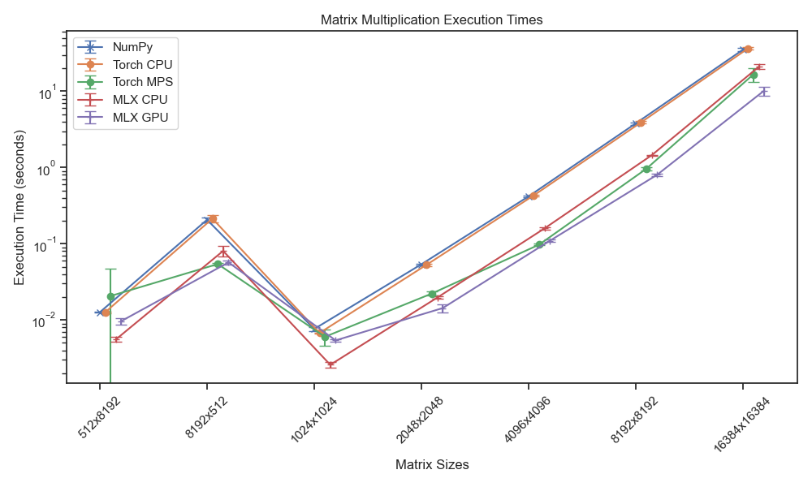
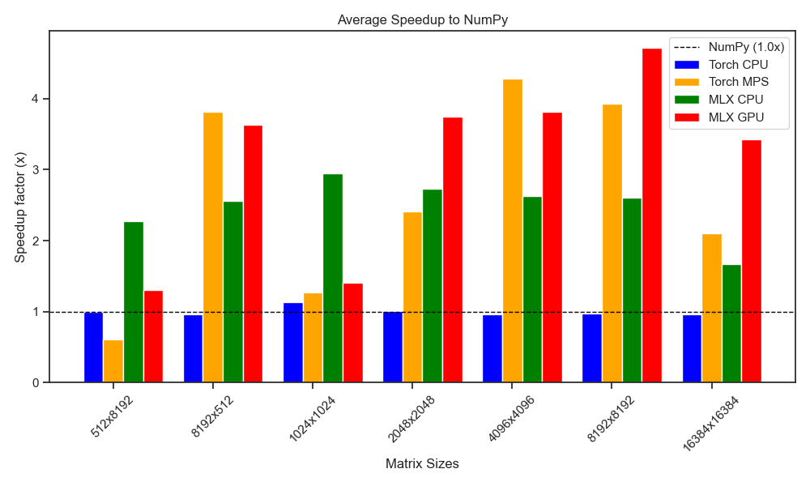

This repository is for testing and experimenting with MLX, PyTorch and NumPy. The script bechmarks the times taken to multiply matrices on CPU/GPU using MLX and PyTorch backends.

Hardware and software used in the test:
Macbook Air M1 2020 (16GB) 7-cores gpu.
Package version: python3.13.3, mlx v0.25.0, pytorch v2.5.1, numpy 2.2.5

The results are shown in following plots:

